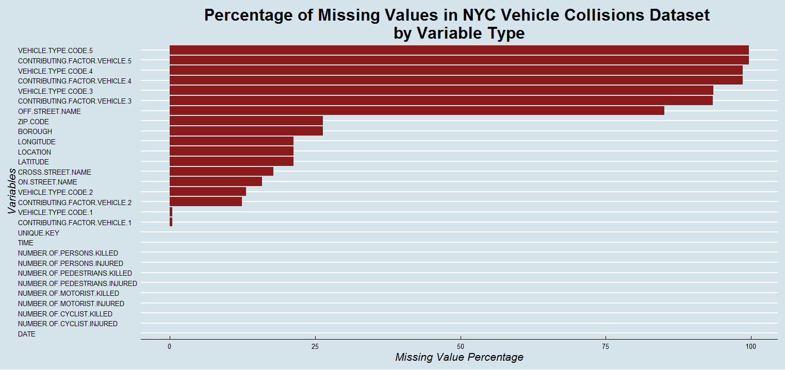
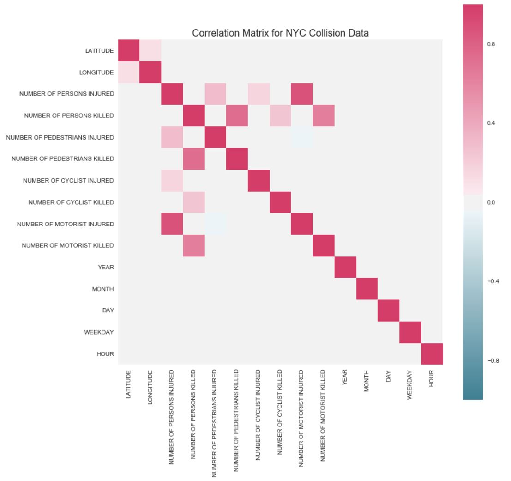

The project is published here: https://ckaavya.github.io/EDAV-Project/

# NYC Motor Vehicle Collisions: Visualizing Trends in Data

### 1. Introduction

NYC is home to more than 8 million people and sees roughly 50 million tourists every year. Being one of the world’s major commercial hubs, there is a lot of traffic on both the roads and subways, the two most popular means of commuting, for most parts of the day. As a result of continuously intensifying interactions as population increases , more frequent accidents on the roads are expected. 
NYC Open Data provides easy access to a lot of data pertaining to motor vehicle accidents on the streets of New York for the time period 2012 -2017. I have selected the time period 2013-2016 for this analysis. There have been several attempts to study, explore and visualise this data. However, I found that not many currently provide any deep insights for making comparisons or for obtaining shifting/emerging trends over the years. The aim of this project is to develop a more comprehensive exploratory visualization tool to enable users to explore more aspects of the data, gather insights and enable them to make better inferences.

Some of the questions I tried to explore through the data are given below:

* What are the most accident-prone regions? Does location influence the number of accidents?
* Daily, weekly, monthly trends? How do trends change over time? What is the most unsafe time to drive in a day?
* What time of the day can we expect to see more accidents? Are there more accidents on weekdays as compared to weekdays?
* What factors contribute more towards accidents?
* Is there a relationship between time of day and contributing factors? Is it true, that alcohol related accidents occur more during the late hours around 12am to 4am?
* What is the proportion of deaths and injuries?
* What are the types of vehicles involved? Do they vary by hour (rush hour vs rest of day)
* Larger the population in an area, more the number of accidents?
* Trends during holidays, special occasions?

#### Data collection

After exploring potential datasets, I found that NYPD collect details about motor vehicle accidents and provides it for free public access on the NYC Open Data website. 

The dataset I used can be found at: https://data.cityofnewyork.us/Public-Safety/NYPD-Motor-Vehicle-Collisions/h9gi-nx95

### 2. Analysis of Data Quality

The dataset obtained from NYC Open data is relatively clean and organized. However, there are a lot of missing values. Missing values per variable/column are shown below.

  

R notebook ‘getMissingness.R’ includes all the code that finds the percentage of missing data and plots the graph above.

While looking at the dataset, I wanted to see how messy and complete it was. In order to obtain meaningful statistics about variables and measure their correlations and importance in predicting the vehicle collisions, it is necessary to get a sense of the distribution of missingness. This is also used in determining the useful variables. While there are several imputation techniques, if a variable has about 80-90% of missing data, it is probably not meaningful to impute the missing data since it is likely that I obtain false values. From this graph, I understood that the following variables were pretty much useless in the future analysis: “Vehicle Type Code 5”, “Contributing Factor Vehicle 5”, “Vehicle Type Code 4”, “Contributing Factor Vehicle 4”, “Vehicle Type Code 3”, “Contributing Factor Vehicle 3” and “Off Street Name”. This also suggests that more than 93% of the collisions occur with up to 2 vehicles.

Ignoring the features with more than 25% missingness, I started thus analysis with location analytics. For carto maps I used the lat and long and for tableau maps I used the zip codes. Most missing data existed not because that they were not recorded, it was simply that they did not exist. For example, an accident involving two cars would not have a feature called ‘Contributing Factor Vehicle 5’. Therefore it is not meaningful to come up with made up data. I also saw that whenever there is a missing value in zip code, there is a high chance that lat and log were missed also. From the correlation matrix of lat and long, I have found that there was not a meaningful relationship between them and other factors. This indicates that I cannot really use other features to impute the lat and long data. Therefore I did not do any imputation.

### 3. Executive Summary

I have analyzed across 20 different existing and engineered features to see if I can find any meaningful relationship between an incident and likelihood of being killed or injured. I have looked at the seasonal, hourly, daily and locational effects along with different vehicle types and various types of contribution factors such as alcohol involvement, fatigue, driver inattention etc. I even went further and analyzed physical characteristics of the locations with the most frequent accidents that are caused by driver inattention, on Google Maps. My main hypothesis was that a particular location with lots of lightening, advertisements or other distractive ads (such as a daring billboard of Moulin Rouge or of a gentlemen’s club) might have caused driver inattention. However, findings disproved this hypothesis, there were no common physical characteristics between analyzed top 5 locations; one was a roundabout in downtown, another one was near Times Square and remaining did not have any meaningful traits. 

Another common cause among accidents was fatigue and couple locations where the frequent accidents happened were near the shopping malls. I posit that long hours of shopping might have caused fatigue related accidents, however this remains a merely correlation rather than a causal finding.

I also calculated something I call "Adjusted Risk Score" by zip code. Essentially, I cannot prevent accidents but what I can do is to minimize the risks when it happens. So I wanted to see whenever an accident happens, how many people died and how many are injured. Based on those, I came up with a basic statistics, which shows the ratio of killed/injured to accidents. This is truly a probabilistic approach; I am just computing a prior distribution. Based on this information, I can then say that certain regions in NYC are safer than others. For example, when I look at the [Adjusted Risk Score Map](https://public.tableau.com/profile/kaavya.chinniah#!/vizhome/riskscore/AdjustedRiskScore), I can clearly see the accidents occurred in Manhattan is less likely to cause a death or injury compared to Brooklyn, Queens and Bronx. One of the possible causes for this is the speed limit. The areas with higher risk scores tend to be located near highways and intercity roads and speed limits are higher in those areas than Manhattan. In Manhattan, there are street lights and heavy traffic that often slows cars significantly. Incidents happened at a slower pace likely to cause fewer injuries. This is actually a known thing, but here I are actually proving it.

My main finding is related to seasonal effects of traffic accidents. Both number of accidents and number of injured by season linearly correlated with type of vehicles used. If I look at the interactive graph [Vehicles Seasonality](https://public.tableau.com/profile/kaavya.chinniah#!/vizhome/falll3/vehicleseason), I can see the clear trends in accidents by vehicle types. In summer and fall, people tend to use bicycles and motorbikes since the weather is relatively nicer, and the usage of taxis drop. This reflects the number of accidents as well. The most accidents and injuries for cyclists happened during the summer, while for taxis most accidents happened in winter and fall (late fall). During the bad weather conditions, it is very unlikely that people bike and they take taxis instead (when it rains or snows). Because of snow, people may not want to use their passenger vehicles during the winter as often, and they choose to commute with bus or subway. The number of vehicle accidents drops during the winter and fall. And as expected, the bus schedules are not affected by seasons and they remain constant throughout the year. Hence, number of accidents for busses remained similar for each season. I also know that bus schedules are more frequent during the work hours; hence I get more accidents from 8 am to 6 pm. Seasonal affects did not really change dramatically by location as well. Brooklyn showed similar trends as Manhattan by season for 4 different vehicle categories that I analyzed. Notice that I combined some categories, believing in that they would show similar characteristics (e.g. bicycle and motorcycle).

In conclusion, the analysis showed that, in order to determine how often an accident happens and how likely it’ll be fatal, one needs to take into account for several important characteristics of a road. Season, time of the day, whether place is located near shopping malls or if there are any roundabouts (literally physical characteristics of roads), speed limits, population (indirectly causing pedestrian traffic which slows the traffic), prior distribution of accident/injury ratio (if I want to approach the problem probabilistic), weekend vs weekday (this is essentially another probabilistic distribution comparison, traffic density), and region.

### 4. Website

All visualizations and descriptions are published online at https://ckaavya.github.io/EDAV-Project/.

### 5. Data cleaning process
The code for data cleaning is available at https://github.com/auygur/ExploratoryDataAnalysis-NyC_Accidents
- CartoMapGetData.ipynb file contains codes for the specifically cleaned data used in CartoDB animations
- Exploratory.ipynb file contains codes for exploratory data analysis, feature engineering, and cleaning. The data derived from this notebook was then used in Tableau implementation.
- getMissingness.R file contains codes to explore the missigness of the data.

I cleaned the data and created different datasets using different approaches. For the carto maps where I needed the location coordinates, deaths and injuries, I used python to preprocess the data. 

Overall use applied the following techniques:
- To ensure that I can use date format in python, I standardized the Date column.
- Some null values were in inconsistent format, such as empty string ‘ ‘ and an empty string with spaces ‘________‘, I fixed this as well.
- Filtered data by date - since I wanted to focus 2013 to 2016
- ZIP CODEs were inconsistent, some were in string format and some in integer format. I standardized the ZIP CODE column.

Python notebook ‘CartoMapGetData.ipynb’ includes all the code that is needed to pre-process the data used in Carto Animation Maps. For this specifically:
- I wrote my own “tidy” functions to get the desired format.
- I created two dataframes, one for injured people and another for killed people.
- Since I used this data for location analytics, I dropped all the rows without any lat and long information.

Python notebook ‘Exploratory.ipynb’ includes all the code that generates data for other plotting purposes. For this specifically;
- I created additional features:
  * YEAR
  * MONTH
  * DAY
  * WEEKDAY [integer value indicating week of the day]
  * HOUR
  * wdaySTATUS : A binary column with following values : “Weekend”, “Weekday”
  * monthStatus: A feature indicating the season of the year (e.g. “Winter”)
  * hourStatus: A feature indicating time status (e.g “Workhour”, “evening” etc)
  * TotalDeathsInjuries: A feature summing the injuries and deaths by row
  * Ref :  A column with all 1s, used for counting purposes.

- I created a new dataframe to get ratio of total injuries and deaths by zip code.

For the following features, I used a correlation matrix to see if there is any relationship: 'LATITUDE', 'LONGITUDE', 'NUMBER OF PERSONS INJURED', 'NUMBER OF PERSONS KILLED', 'NUMBER OF PEDESTRIANS INJURED', 'NUMBER OF PEDESTRIANS KILLED', 'NUMBER OF CYCLIST INJURED', 'NUMBER OF CYCLIST KILLED', 'NUMBER OF MOTORIST INJURED', 'NUMBER OF MOTORIST KILLED', 'YEAR', 'MONTH', 'DAY', 'WEEKDAY', 'HOUR'. Conclusion was that for specific lat and long location, there is no meaningful correlation between deaths, injuries and location. This is most likely due to the fact that I used too specific values such as long and lat. There were some relationships between injured and deaths but this was nothing out of ordinary.

  

### 6. Conclusion 
The project was an in-depth exercise to explore and study trends and patterns in the NYC motor vehicle collision dataset. Through the course of the project, I deepened my expertise in several data visualization tools including R, Python, CartoDB and Tableau.

##### Limitations:
The visualizations currently capture only limited trends. The dataset has several variables that could be explored in greater depth such as factors contributing to accidents, vehicle types involved and a deeper analysis of socio-geographic elements which influence these.
Since data was mostly discrete/categorical, options for charting were comparatively limited.

##### Future directions:

The next step in analysis would be to merge the dataset with external datasets pertaining to NYC such as for weather data, population data, socio-economic data etc. to draw deeper insights.

